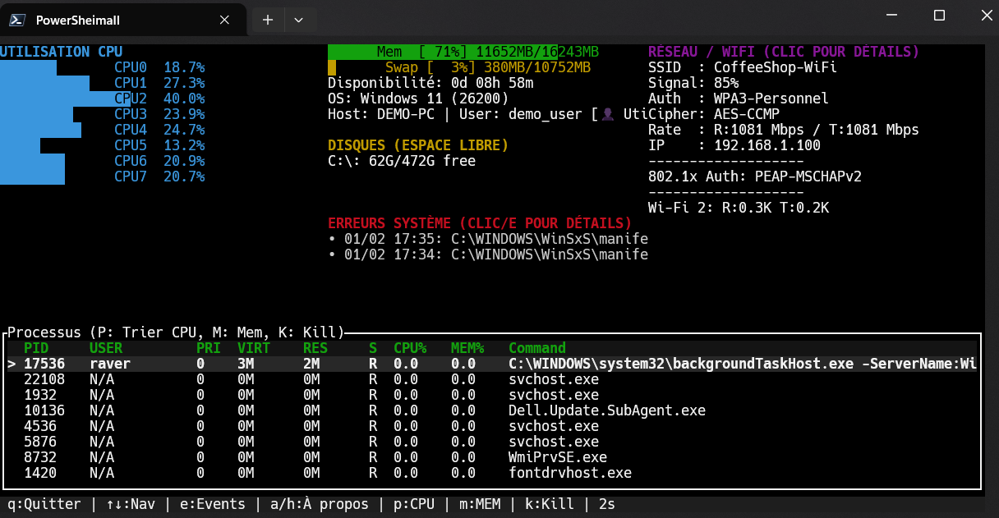

# HtopRust

A modern, feature-rich system monitor for Windows with an htop-like terminal interface.


## 📖 About

**HtopRust** is a modern system monitor for Windows, inspired by the popular `htop` tool on Linux. Built entirely in Rust, it brings the power and elegance of terminal-based monitoring to Windows with native performance and zero dependencies.

### Why HtopRust?

Windows users have long envied the simplicity and power of `htop` on Linux. While Task Manager and Resource Monitor are useful, they lack the efficiency and keyboard-driven workflow that makes `htop` so beloved. HtopRust bridges this gap by providing:

- **Native Performance**: Written in Rust with direct Windows API calls
- **Zero Dependencies**: Single portable executable, no runtime required
- **Rich Features**: Beyond basic monitoring - includes Wi-Fi details, 802.1x authentication info, and Windows Event Log integration
- **Modern UI**: Color-coded, mouse-enabled terminal interface with real-time updates
- **Smart Adaptation**: Auto-detects language, terminal capabilities, and privilege level

### Author

Created by **Olivier Noblanc** in 2026 as a personal project to bring professional-grade system monitoring to Windows in a lightweight, portable package.

## 📸 Screenshot



*HtopRust running in demo mode with anonymized data*

## ✨ Features

### Process Management
- 📊 **Real-time monitoring** of CPU, memory, and process status
- 🔍 **Process details** with full command line and resource usage
- 🎯 **Kill processes** with admin privileges
- 🔄 **Sorting** by PID, name, CPU, or memory
- 🎨 **Color-coded** display with intuitive UI

### System Information
- 💻 **CPU usage** per core with real-time graphs
- 🧠 **Memory & Swap** usage with visual gauges
- 💾 **Disk space** monitoring
- 🌐 **Network interfaces** details
- ⏱️ **System uptime** tracking

### Wi-Fi Details
- 📡 **Complete Wi-Fi information** (SSID, BSSID, channel, frequency)
- 🔒 **802.1x authentication detection** (PEAP, EAP-TLS, MSCHAPv2)
- 📶 **Signal strength** and connection rates
- 🔐 **Security details** (authentication & cipher methods)

### System Events
- ⚠️ **System error monitoring** from Windows Event Log
- 🔎 **Detailed event viewer** with timestamps and descriptions
- 📋 **Event navigation** with full message display

### Smart Features
- 🌍 **Bilingual** (English/French) with auto-detection
- 🔤 **UTF-8 fallback** for legacy terminals (auto ASCII mode)
- 🔐 **Privilege detection** with visual badge (Admin/User)
- ⚡ **Configurable refresh rate** (1s, 2s, 5s)
- 🖱️ **Mouse support** with scroll and click navigation

## 🚀 Installation

### Pre-built Binary
Download the latest `HtopRust.exe` from the [Releases](https://github.com/olivier-noblanc/HtopRust/releases) page.

**Requirements:**
- Windows 7 or later
- No runtime dependencies required (fully portable!)

### Build from Source
```bash
# Clone the repository
git clone https://github.com/olivier-noblanc/HtopRust.git
cd HtopRust

# Build release version
cargo build --release

# Run
cargo run --release
```

## 📖 Usage

### Launch
Double-click `HtopRust.exe` or run from terminal:
```bash
HtopRust.exe
```

### Keyboard Shortcuts

| Key | Action |
|-----|--------|
| **q** / **F10** | Quit |
| **↑ ↓** | Navigate up/down |
| **Enter** | View process/event details |
| **Esc** | Return to previous view |
| **e** | Toggle Events view |
| **k** | Kill selected process (requires admin) |
| **p** | Sort by PID |
| **c** | Sort by CPU |
| **m** | Sort by Memory |
| **n** | Sort by Name |
| **s** | Cycle refresh rate (1s → 2s → 5s) |

### Views

#### 1. Process List (Default)
- Real-time process monitoring
- Color-coded status indicators
- Press **Enter** to view detailed information

#### 2. System Events
- Press **e** to access
- View Windows system errors and warnings
- Press **Enter** for full event details

#### 3. Wi-Fi Details
- Click on the Wi-Fi panel
- Complete network information
- 802.1x authentication details (if applicable)

#### 4. Process Details
- Press **Enter** on any process
- Live CPU/memory updates
- Navigate with **↑↓** to view other processes

## 🔒 Privilege Levels

HtopRust works in both **Admin** and **User** modes:

| Feature | Admin ✅ | User ⚠️ |
|---------|---------|---------|
| View all processes | Full access | User processes only |
| Kill processes | Any process | Own processes only |
| System events | Full access | Limited access |
| Wi-Fi details | Full access | Basic info only |

For full functionality, **run as Administrator**.

## 🛠️ Technical Details

- **Language:** Rust (edition 2024)
- **TUI Framework:** Ratatui
- **Terminal:** Crossterm
- **System Info:** Sysinfo
- **Windows APIs:** windows-rs

### Optimizations
- **Size optimized** with LTO and dead code elimination
- **Single binary** with no external dependencies
- **UTF-8 detection** for maximum terminal compatibility
- **Efficient refresh** with selective updates

## 📄 License

MIT License - Copyright (c) 2026 Olivier Noblanc

## 🤝 Contributing

Contributions are welcome! Feel free to:
- Report bugs
- Suggest features
- Submit pull requests

## 📬 Contact & Author

**Author:** Olivier Noblanc (2026)
- Created as a personal project to bring professional-grade system monitoring to Windows in a lightweight, portable package.
- Feel free to report bugs or suggest features via GitHub issues.

**Note:** This is a Windows-specific application. For Linux/macOS, consider using the original `htop`.
